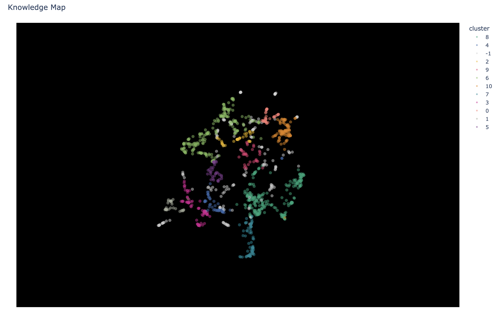

I recommend you first take a look at [crash-course.md](./crash-course.md) (this is what I am currently doing)

*3D visualization of textbook embeddings clustered using HDBSCAN*

## Running the code
* for `.ipynb` use google colab
* for `.py` the repo uses `uv` - ex: `uv sync`, `uv run crash_course/module_2/naive_rag.py`

If you enjoy the crash course, check out [syllabus_v2_opus.md](./syllabus_v2_opus.md) (this one has not been reviewed by a human yet)
